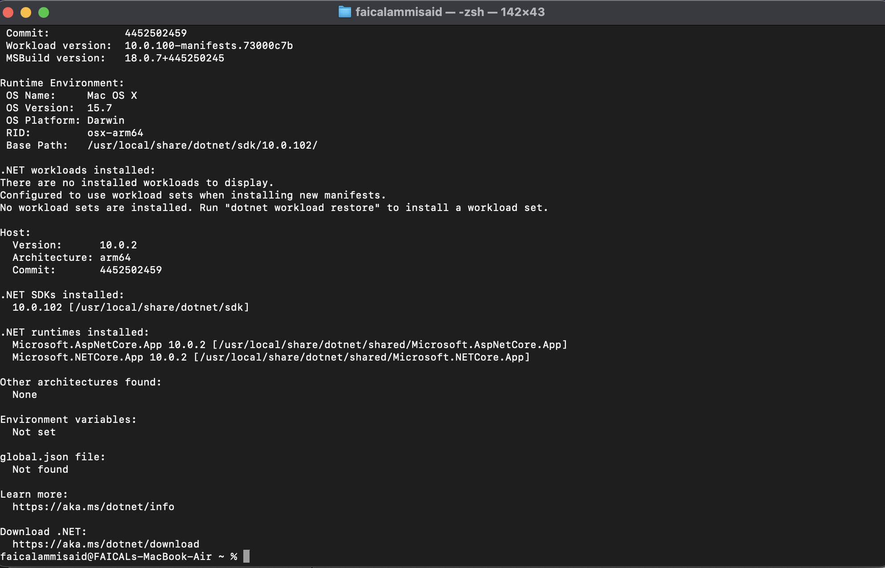
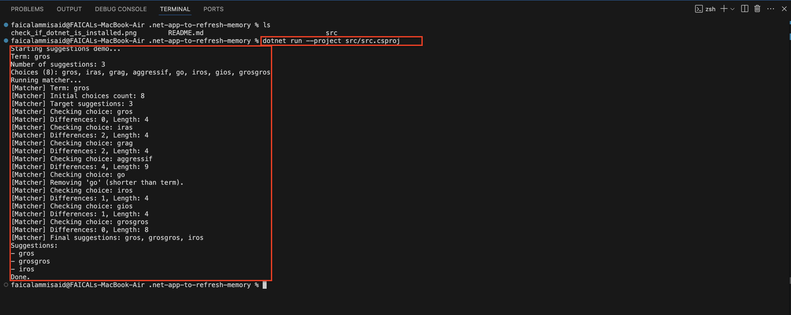

# Term Suggestions (C# / .NET)

A small .NET console app that demonstrates a simple “term suggestions” matcher. Given an input `term`, a list of candidate `choices`, and a maximum number of results, it returns the best matches using a lightweight character-by-character difference score.

## What this app does

1. Filters out candidates shorter than the input term.
2. Scores each remaining candidate by counting how many characters differ at the same index for the first `term.Length` characters.
3. Sorts candidates by fewest mismatches, then by shortest length.
4. Returns the top `numberOfSuggestions` results.

## Requirements

- .NET SDK that supports the target framework in `src/src.csproj` (currently `net10.0`).

## Install .NET SDK

Use the official installer from Microsoft. Choose the SDK (not just the runtime).

Download page:

```text
https://dotnet.microsoft.com/en-us/download
```

### macOS

1. Install with Homebrew:

```bash
brew install --cask dotnet-sdk
```

2. Verify in a new terminal (should show SDK `10.x`):

```bash
dotnet --info
```


### Windows

1. Download the Windows .NET SDK installer from:

```text
https://dotnet.microsoft.com/download
```

2. Run the installer.
3. Open PowerShell and verify (should show SDK `10.x`):

```powershell
dotnet --info
```


## Build

```bash
dotnet build src/src.csproj
```

## Change inputs

Edit `src/Program.cs`:

- `term` — the user input
- `choices` — candidate strings
- `numberOfSuggestions` — number of results to return

## Project files and what they do

- `README.md` — setup, usage, and explanation of the algorithm.
- `.net-app-to-refresh-memory.sln` — Visual Studio solution file that points to the project.
- `.gitignore` — ignores build outputs like `bin/` and `obj/`.
- `.github/workflows/build.yml` — GitHub Actions workflow that builds the project on pull requests.
- `.vscode/ settings.json` — VS Code workspace setting that selects the solution file.
- `.vscode/ tasks.json` — VS Code build task that runs `dotnet build`.
- `.vscode/launch.json` — VS Code run configuration for the console app.
- `src/src.csproj` — project file (target framework, build settings).
- `src/Program.cs` — console entry point and example usage.
- `src/IAmTheTest.cs` — interface and matcher implementation.

## Run

From the repo root:

```bash
dotnet run --project src/src.csproj
```

Expected output format:

```text
Suggestions:
<suggestion 1>
<suggestion 2>
...
```


## Troubleshooting

### Target framework not supported

If you see errors about `net10.0`, install a .NET SDK that supports it, or change `<TargetFramework>` in `src/src.csproj` to a framework you have installed, then rebuild.

### `dotnet` command not found

The .NET SDK is not installed or your terminal has not reloaded your PATH. Install the SDK, close the terminal, open a new one, and run `dotnet --info`.

### No suggestions returned

Verify that your `choices` list contains strings with length >= `term.Length`, and that `numberOfSuggestions` is greater than 0.
